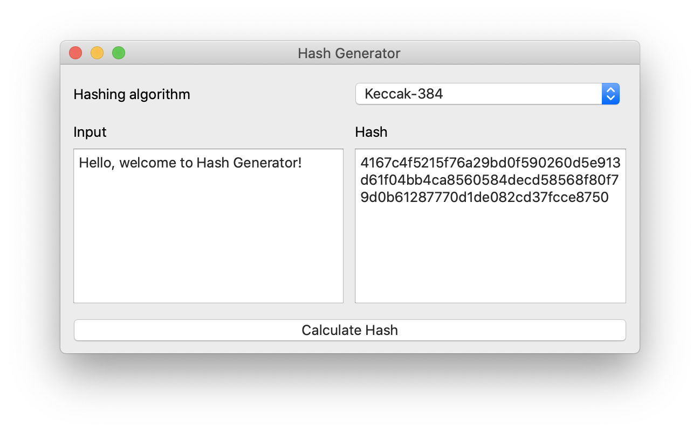

# Hash Generator

[](LICENSE)
[](https://www.codacy.com/manual/bartkessels/HashGenerator?utm_source=github.com&amp;utm_medium=referral&amp;utm_content=bartkessels/HashGenerator&amp;utm_campaign=Badge_Grade)
[](https://codecov.io/gh/bartkessels/hashgenerator)

<br>

|__Linux / MacOS__|__Windows__|
|---|---|
|[](https://travis-ci.org/bartkessels/HashGenerator)|[](https://ci.appveyor.com/project/bartkessels/hashgenerator)|


Application to generate different kind of hashes

---

## Table of contents

- [1. Screenshots](#1-screenshots)
- [2. Features](#2-features)
    - [2.1 Supported hashing algorithms](#21-supported-algorithms)
- [3. Required packages](#3-required-packages)
- [4. Build](#4-build)
    - [4.1 Tests](#41-tests)
        - [4.1.1 Test coverage](#411-test-coverage)
    - [4.2 Application](#42-application)

## 1. Screenshots



## 2. Features

Hash Generator is a small application to generate multiple hashes from any input string you give it.
The code is designed to easily add new hashing algorithms so if you're missing anything feel free
to open a pull-request or create an issue.

### 2.1 Supported algorithms

- Keccak-224
- Keccak-256
- Keccak-384
- Keccak-512
- MD4
- MD5
- SHA1
- SHA224
- SHA256
- SHA384
- SHA512
- SHA3-224
- SHA3-256
- SHA3-284
- SHA3-512

## 3. Required packages

Hash Generator only uses the `Core` and `Widgets` components of the Qt5 library for the GUI.
To run the tests Hash Generator requires Catch2 which will be fetched when building `hashgen_tests`
so there's no need to install any libraries or header files.

## 4. Build

### 4.1 Tests

```bash
$ mkdir build
$ cd build
$ cmake ..
$ make hashgen_tests
$ ./bin/hashgen_tests
```
### 4.1.1 Test coverage

When building the tests the required compiler flags are set to generate the coverage reports for each
individual source file. The coverage reports can be bundled using lcov which will generate a *.info file
which can be transformed into a html file using the genhtml command.

```bash
$ lcov --directory tests/CMakeFiles/hashgen_tests.dir --capture --output-file hashgen_coverage.info
$ genhtml -o coverage/ hashgen_coverage.info
$ open coverage/index.html
```

### 4.2 Application

```bash
$ mkdir build
$ cd build
$ cmake ..
$ make hashgen
$ ./bin/hashgen
```
